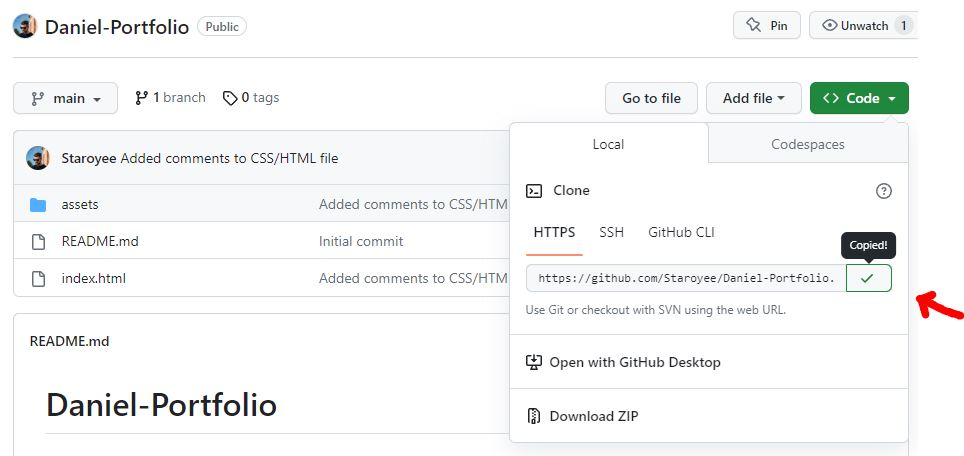
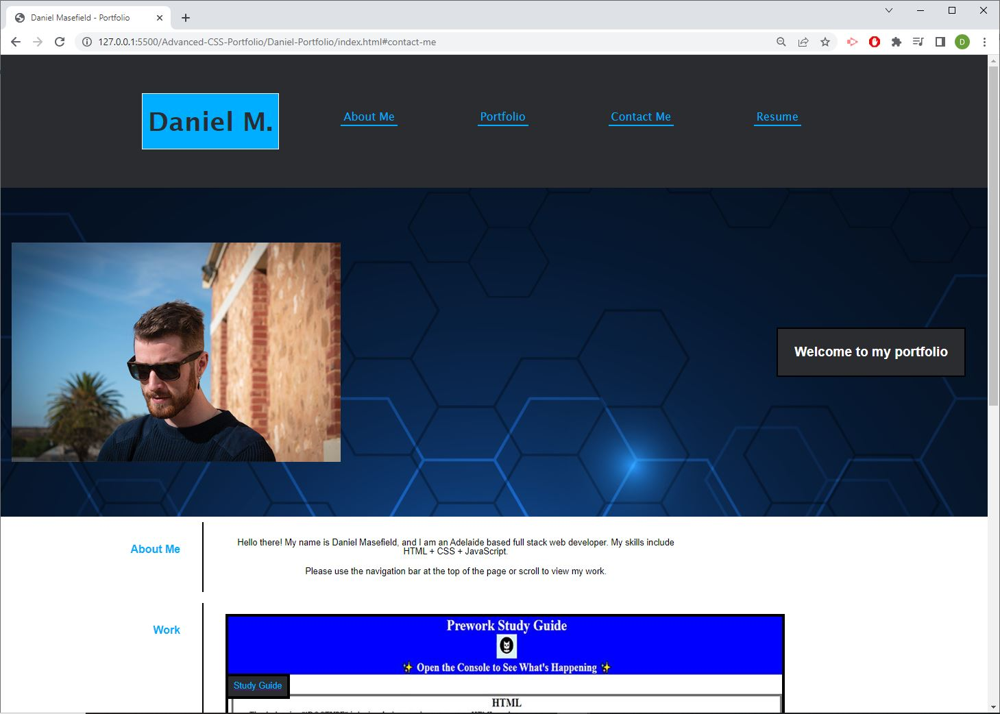
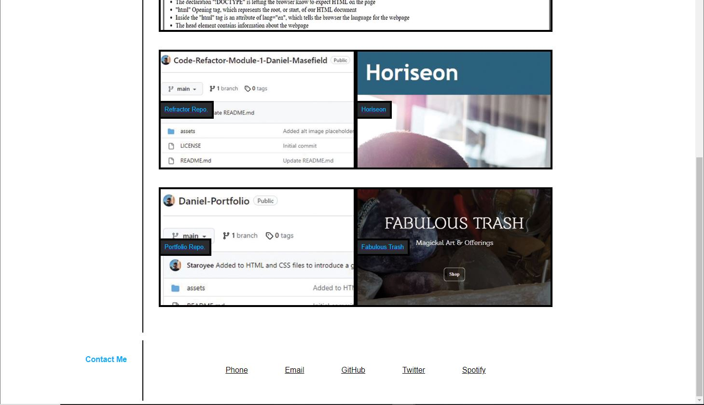

# Daniel-Portfolio

## Description
I was tasked create a portfolio website using HTML and CSS so that an employer could view a potential employee's work, to assess whether they are a good candidate for an open position.

I was motivated to undertake this task because I wished to gain a greater understanding of HTML and CSS languages and how they are used with one another.

## Solve
The current completion of the webpage solves the problem of the employer not being able to view a potential employee's portfolio.

The portfolio webpage is now deployed for the employer to view.

## I have learned:
* How to use flexbox more effectively
* How to use href to link elements to the nav bar within the webpage.
* How to use @media queries to select elements to be changed as the page size changes.
* How to use the :hover selector to apply styling to certain elements when moused over.
* How to build a webpage from a blank canvas.

## Installation
Steps to install this project on your local PC
1. Open the termal on your machine.
2. Use the terminal command `cd` to navigate to the directory where we want the repository located.
3. Locate the 'Code' button on the 'Daniel-Portfolio' github repository, click it, then copy the 'HTTPS' link to clipboard. (See image)

4. Use the git command `git clone` followed by the URL copied from Github to clone the repo to our machine.
5. The `git clone` command creates a new directory with the same name as the repository. We navigate into our new directory using `cd`.
6. The repository should now be cloned onto your device and able to be edited in VScode or another editing software.

## Instructions

To navigate the site click on one of the different headings in the header at the top of the page to jump to each individual topic.

## Deployed Application Link

## Screenshot
The page was too large to fit onto my screen in one screenshot. I have provided two screenshots to make it show the entire page seamlessly through both screenshots.

## License
MIT License

## Credits
https://www.w3schools.com/html/html5_semantic_elements.asp
https://www.pluralsight.com/guides/semantic-html
https://web.dev/learn/html/semantic-html/
https://learntheweb.courses/topics/html-semantics-cheat-sheet/
https://www.w3schools.com/css/css_rwd_viewport.asp
https://www.geeksforgeeks.org/physical-and-logical-tags-in-html/
https://www.simplilearn.com/tutorials/html-tutorial/html-semantics#:~:text=The%20semantic%20HTML%20tags%20help,offers%20a%20better%20user%20experience.
https://coding-boot-camp.github.io/full-stack/github/professional-readme-guide
